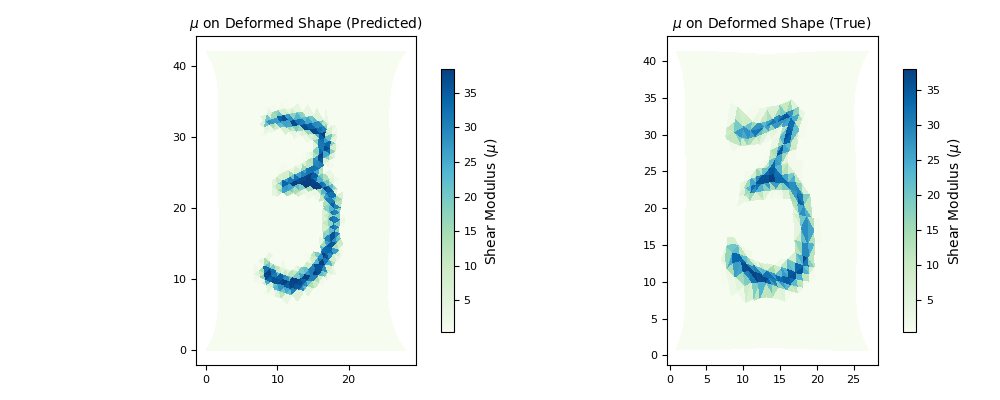
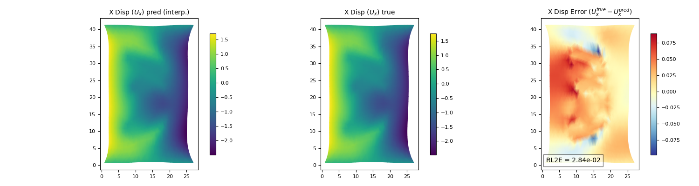
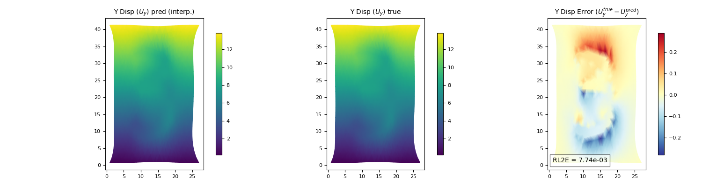
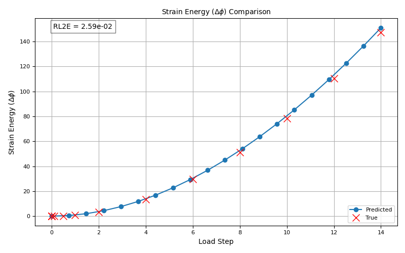
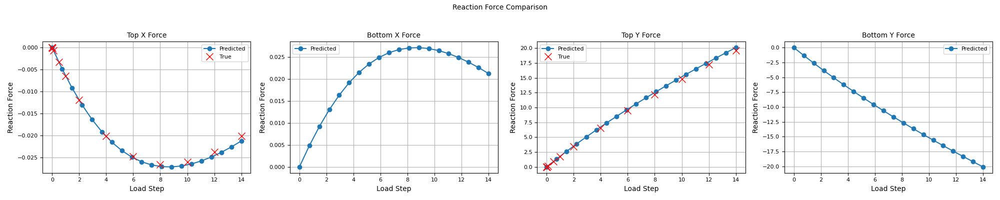

# 2D Nonlinear Finite Element Method (FEM) for Mechanical MNIST on GPU

This project implements a 2D nonlinear hyperelasticity solver using a fully differentiable Finite Element Method (FEM) in PyTorch and scikit-fem, with GPU acceleration. It is designed to simulate the mechanical response of heterogeneous materials, specifically tailored for analyzing Mechanical MNIST patterns under various loading conditions, which is also the ground basis for an option in AI powering up.

## Features

-   **GPU Acceleration**: Leverages PyTorch for efficient computation on NVIDIA GPUs.
-   **Differentiable FEM**: Implements a fully differentiable solver for nonlinear hyperelasticity problems.
-   **Newton-Raphson Solver**: Utilizes an incremental loading strategy with a robust Newton-Raphson method to solve the nonlinear equilibrium equations.
-   **Heterogeneous Materials**: Assigns material properties based on input `material_map` (e.g., MNIST images).
-   **Nonlinear Material Models**: Supports Neo-Hookean and St. Venant-Kirchhoff material models.
-   **Incremental Loading**: Solves the nonlinear system through a series of load steps.
-   **Comprehensive Post-processing**: Generates plots for material distribution, displacement fields, strain energy, and reaction forces, including comparisons with true reference data.

## Technical Overview and Algorithm Details

This section provides a deeper insight into the finite element formulation and the numerical solution strategy implemented in `src/fem_solver.py`.

### Nonlinear Finite Element Formulation

The solver addresses 2D nonlinear hyperelasticity problems, where both large deformations (geometric nonlinearity) and nonlinear material responses (material nonlinearity) are considered. The core idea is to find the displacement field `u` that minimizes the total potential energy of the system, or equivalently, satisfies the equilibrium equations. This is achieved by solving a system of nonlinear equations derived from the weak form of the equilibrium equations.

### Material Models

Two hyperelastic material models are supported:

-   **Neo-Hookean Model**: A commonly used model for rubber-like materials, characterized by a strain energy density function `W` that depends on the first invariant of the right Cauchy-Green deformation tensor (or equivalently, the stretch ratios). The first Piola-Kirchhoff stress tensor `P` is derived from this `W` and is implemented in `compute_internal_forces`.
-   **St. Venant-Kirchhoff Model**: This model is based on Green-Lagrange strain and assumes a quadratic strain energy density function. It is often used for moderately large deformations but can become less accurate for very large strains compared to Neo-Hookean. The second Piola-Kirchhoff stress tensor `S` is computed from the Green-Lagrange strain, and then converted to `P`.

The material properties (Young's Modulus `E` and Poisson's Ratio `ν`) are assigned heterogeneously across the domain based on the input `material_map`. This allows for simulating materials with spatially varying stiffness, as is the case with the Mechanical MNIST dataset.

### Galerkin Weak Form and Internal Forces

The discrete equilibrium equations are derived using the Galerkin method. The internal force vector, `f_int`, is computed by integrating the first Piola-Kirchhoff stress tensor `P` multiplied by the gradient of the basis functions over each element. This operation is performed by the `compute_internal_forces` method, which is vectorized across elements and quadrature points for efficiency on the GPU.

### Newton-Raphson Solution Strategy

Due to the nonlinearity of the problem, a direct solution is not feasible. An incremental loading strategy combined with the **Newton-Raphson method** is employed to find the equilibrium solution:

1.  **Incremental Loading**: The total displacement is applied in several small load steps (`displacement_schedule`). At each step, the solution from the previous step serves as the initial guess.
2.  **Residual Calculation**: At each Newton-Raphson iteration, a residual vector `R(u) = f_int(u) - f_ext` is computed, where `f_ext` are external forces (or, in this case, boundary condition induced forces).
3.  **Jacobian (Tangent Stiffness Matrix) Computation**: The Jacobian of the residual with respect to the displacement degrees of freedom (`∂R/∂u`) forms the tangent stiffness matrix. This crucial step is made efficient and accurate by leveraging PyTorch's automatic differentiation (`torch.func.jacrev`) to compute the element-wise Jacobian. The `torch.vmap` function is used to vectorize this computation over all elements, significantly speeding up the assembly process.
4.  **Sparse Linear System Solution**: The assembled global Jacobian is a large, sparse matrix. The linear system `J Δu = -R` is solved for the displacement increment `Δu` using `scipy.sparse.linalg.spsolve`, which is applied to the CPU-converted sparse matrix. The utility function `sparse_coo_to_csc` facilitates conversion from PyTorch's sparse COO format to SciPy's CSC format.
5.  **Update Displacement**: The displacement field is updated iteratively: `u_new = u_old + η * Δu`, where `η` is a stability factor (line search) to ensure convergence and prevent divergence due to large increments.
6.  **Convergence Check**: The process continues until the norm of the residual vector falls below a specified tolerance or the maximum number of iterations is reached.

The implementation specifically benefits from PyTorch's ability to perform these calculations on the **GPU** (CUDA), enabling fast tensor operations and automatic differentiation for the complex nonlinear mechanics.

## Mechanical MNIST Dataset

This project is specifically designed to work with the **Mechanical MNIST** dataset, an extension of the classic MNIST handwritten digit dataset into the domain of solid mechanics. Here's a brief overview:

-   **Construction**: Each original grayscale MNIST image (28x28 pixels) is reinterpreted as a material map on a 2D square domain. White pixels represent a stiff material (higher Young's modulus), while black pixels represent a soft material (lower Young's modulus). This creates a heterogeneous material layout corresponding to each digit.
-   **Contents**: The dataset includes:
    -   Material maps (flattened 28x28 pixel images) for various digits (`mnist_img_train.txt`).
    -   Reference displacement fields ($U_x$, $U_y$) for uniaxial extension tests, obtained from high-fidelity commercial FEM simulations (`summary_dispx_train_step12.txt`, `summary_dispy_train_step12.txt`). These are provided on a coarser grid corresponding to the original MNIST pixels.
    -   Reference total strain energy ($\Delta\phi$) for each load step (`summary_psi_train_all.txt`).
    -   Reference reaction forces for each load step (`summary_rxnx_train_all.txt`, `summary_rxny_train_all.txt`).
-   **Problem Studied**: The primary problem involves subjecting these heterogeneous material samples to mechanical loads (e.g., uniaxial extension along the Y-axis by fixing the bottom edge and prescribing displacement on the top edge) and analyzing their nonlinear deformation behavior. The goal is to predict displacement fields, stress distributions, strain energy, and reaction forces, and compare them against the provided reference solutions.

## Project Structure

The project is organized into a modular structure for clarity and maintainability:

```
mechanical_mnist_fem_gpu/
├── main.py                     # Main script to run the FEM simulation and plotting
├── requirements.txt            # List of Python dependencies
└── src/                        # Source directory for core modules
    ├── fem_solver.py           # Contains the ClassicNonlinearFEM class and its methods
    └── utils.py                # Utility functions and global configurations (DTYPE, DEVICE)
```

## Dependencies

This project requires the following Python packages. They can be installed using `pip`:

-   `torch` (PyTorch)
-   `numpy`
-   `skfem`
-   `matplotlib`
-   `scipy`
-   `pygmsh`

## Installation

1.  **Navigate to the project directory:**
    ```bash
    cd ~/path/to/your/folder
    ```

2.  **(Optional) Create and activate a Python virtual environment:**
    ```bash
    python -m venv venv
    source venv/bin/activate
    ```

3.  **Install the required Python packages:**
    ```bash
    pip install -r requirements.txt
    ```

## Usage

Run the main script `main.py` from the project root directory. You can specify the dataset path and the MNIST image index using command-line arguments.

### Example Command

To run the simulation using a specific dataset path and MNIST image index (e.g., index `10` from the dataset located at `/home/gengzhan/Research/dataset/Mechanical_MNIST/Uniaxial_Extension`):

```bash
python main.py --data-path /home/gengzhan/Research/dataset/Mechanical_MNIST/Uniaxial_Extension --mnist-index 10
```

-   `--data-path`: **(Required)** Specifies the root directory of your Mechanical MNIST dataset. This path should contain `MNIST_input_files/` and `FEA_displacement_results_step12/` (and other `FEA_...` folders as per your original structure).
-   `--mnist-index`: **(Optional)** Specifies the index of the MNIST image to use for the material map and for loading corresponding true displacement/force data. Defaults to `100` if not provided.
-   `--element-order`: **(Optional)** Order of finite elements (1 for P1, 2 for P2). Defaults to `2`.
-   `--n-nodes-approx`: **(Optional)** Approximate number of nodes for mesh generation. Defaults to `1000`.

### Default Behavior

If you run `python main.py` without any arguments, it will use the default `data-path` (`/dataset/Mechanical_MNIST/Uniaxial_Extension`) and `mnist-index` (`100`) as defined in `main.py`, matching the original script's hardcoded behavior.

## Data Requirements

The script expects the data files to be organized within the `--data-path` directory as follows (example for `mnist-index = 10`):

```
/your/data/path/
├── MNIST_input_files/
│   └── mnist_img_train.txt
├── FEA_displacement_results_step12/
│   ├── summary_dispx_train_step12.txt
│   └── summary_dispy_train_step12.txt
├── FEA_psi_results/
│   └── summary_psi_train_all.txt
└── FEA_rxnforce_results/
    ├── summary_rxnx_train_all.txt
    └── summary_rxny_train_all.txt
```

Ensure that `U_x_reference_{index}.txt`, `U_y_reference_{index}.txt`, `phi_reference_{index}.txt`, `F_reference_{index}.txt` are available in `output_uniaxial_extension` if `fem_solver.plot_results` references them (though the current `main.py` loads them from other `FEA_` prefixed folders for the comparison, matching the original script).

## Output

After running the `main.py` script, the following plots will be generated and saved into the `results/` directory within the project's root folder. These plots compare the FEM simulation results directly against the reference data from the Mechanical MNIST dataset, demonstrating the consistency and accuracy of the implemented solver.

Note that in this implementation I just used around 1000 nodes for interpolation, compared with more than 30K nodes in the origin FEniCS code.

### Material Property Distribution


### X-Displacement Field Comparison


### Y-Displacement Field Comparison


### Strain Energy Comparison


### Reaction Force Comparison


## License

This project is licensed under the MIT License - see the [LICENSE](LICENSE) file for details.

```
MIT License

Copyright (c) [2026] [Gengzhan Guo]

Permission is hereby granted, free of charge, to any person obtaining a copy
of this software and associated documentation files (the "Software"), to deal
in the Software without restriction, including without limitation the rights
to use, copy, modify, merge, publish, distribute, sublicense, and/or sell
copies of the Software, and to permit persons to whom the Software is
furnished to do so, subject to the following conditions:

The above copyright notice and this permission notice shall be included in all
copies or substantial portions of the Software.

THE SOFTWARE IS PROVIDED "AS IS", WITHOUT WARRANTY OF ANY KIND, EXPRESS OR
IMPLIED, INCLUDING BUT NOT LIMITED TO THE WARRANTIES OF MERCHANTABILITY,
FITNESS FOR A PARTICULAR PURPOSE AND NONINFRINGEMENT. IN NO EVENT SHALL THE
AUTHORS OR COPYRIGHT HOLDERS BE LIABLE FOR ANY CLAIM, DAMAGES OR OTHER
LIABILITY, WHETHER IN AN ACTION OF CONTRACT, TORT OR OTHERWISE, ARISING FROM,
OUT OF OR IN CONNECTION WITH THE SOFTWARE OR THE USE OR OTHER DEALINGS IN THE
SOFTWARE.
```

## Reference
The paper and implimentation from Emma

- https://doi.org/10.1016/j.eml.2020.100659

- https://github.com/elejeune11/Mechanical-MNIST.git

- https://open.bu.edu/handle/2144/39371
